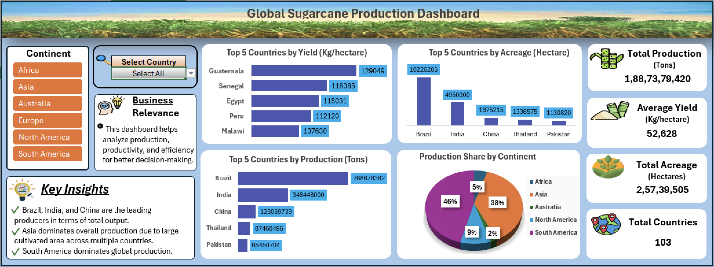

# Sugarcane Production Data Analysis (Excel Dashboard) 🌱

## 📊 Project Overview
This project analyzes global sugarcane production data using Microsoft Excel. The objective was to clean raw data, perform analysis, and build an interactive dashboard to generate meaningful insights.

## 🛠 Tools & Technologies Used
•⁠  ⁠Microsoft Excel
•⁠  ⁠Pivot Tables & Pivot Charts
•⁠  ⁠Data Cleaning & Transformation
•⁠  ⁠Dashboard Design

## 🤖 Tools & Assistance
•⁠  ⁠GitHub Copilot (used for guidance in formulas and improving workflow efficiency)

## 📂 Dataset
The dataset includes:
•⁠  ⁠Country
•⁠  ⁠Continent
•⁠  ⁠Production (Tons)
•⁠  ⁠Acreage (Hectare)
•⁠  ⁠Yield (Kg/Hectare)

The dataset used in this project is included in this repository.

## ⚙️ Advanced Excel Techniques Used
•⁠  ⁠IF and IFERROR functions for conditional logic and error handling
•⁠  ⁠SUMIF and SUMIFS for dynamic aggregation
•⁠  ⁠ISNUMBER and MATCH for filtering and lookup logic
•⁠  ⁠Implemented "Select All" condition for dynamic calculations
•⁠  ⁠Created Yes/No flag system for filtering
•⁠  ⁠Dynamic KPI calculations based on user selection

## 📈 Key Insights
•⁠  ⁠Identified top sugarcane producing countries
•⁠  ⁠Compared production across continents
•⁠  ⁠Analyzed yield vs acreage trends
•⁠  ⁠Observed regional performance differences

## 📊 Dashboard Features
•⁠  ⁠Interactive Excel dashboard
•⁠  ⁠KPI metrics:
  - Total Production
  - Total Acreage
  - Average Yield
  - Total Countries
•⁠  ⁠Dynamic filtering using slicers and formulas
•⁠  ⁠Clean and user-friendly design

## 📸 Dashboard Preview

## 🚀 What I Learned
•⁠  ⁠Building interactive dashboards in Excel
•⁠  ⁠Using advanced formulas for dynamic calculations
•⁠  ⁠Data cleaning and transformation
•⁠  ⁠Creating user-driven analysis reports

## 📁 Project Structure
•⁠  ⁠sugarcane_production_dashboard.xlsx → Main dashboard file  
•⁠  ⁠sugarcane_dataset.csv → Raw dataset  
•⁠  ⁠sugarcane_dashboard_preview.png → Dashboard screenshot  

## 👤 Author
Prem Ranjan  

•⁠  ⁠GitHub: https://github.com/prem-ranjan-analytics
•⁠  ⁠LinkedIn: https://www.linkedin.com/in/prem-ranjan-6492623b1

---

⭐ Feel free to explore the project and provide feedback!
